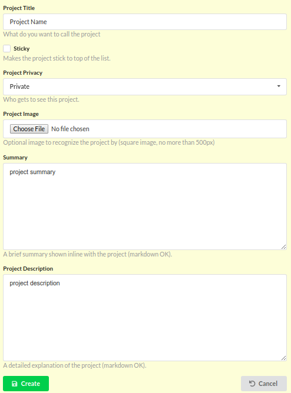
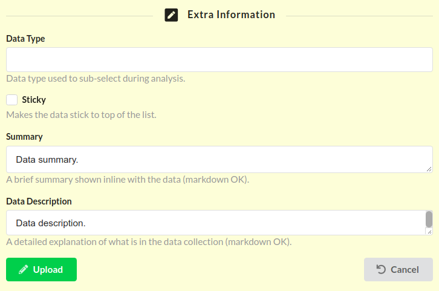
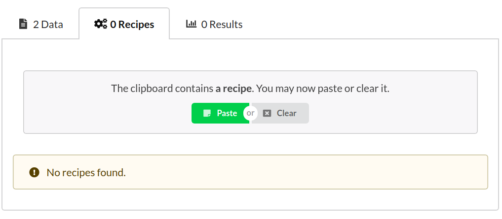
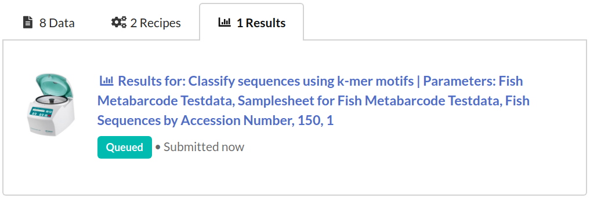
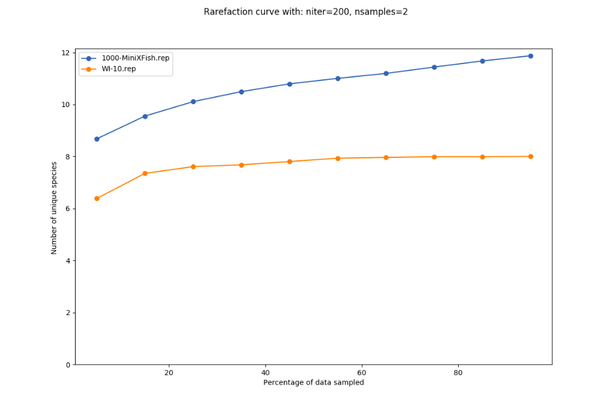
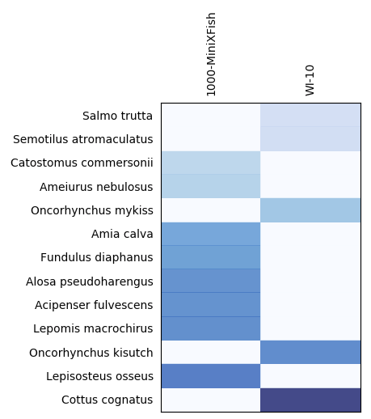

## Collaborative Analysis in Bioinformatics 
 
Natay Aberra 
Aswathy Sebastian 
Istavan Albert 

---

## Introduction 
Bioinformatics Consulting Center at Penn State 
- __Dr. Istvan Albert__ 
- __Aswathy Sebastian__ 
- __Natay Aberra__ 

---

## The problem 

In many cases, one lab can not recreate the results of another even if both start with the same data set.

- __Problem__ : Bioinformatics is experiencing a _reproducibility crisis_. 
- __Solution__ :  A web application allowing scientists to document, execute and share data analysis scripts. 
    - We call these analysis scripts ___recipes___. 
  
---

## What is a bioinformatics recipe?

__Recipe__: a collection of commands + an graphical user interface.

It may be a bash script, an R script, a series of mothur instructions. Basically any list of commands that can be executed in an environment.

 

A biologist can easily run it!

---
## Recipe interface

---
## Is a recipe a "pipeline"?
Yes. A recipe may be thought of as a web-enabled pipeline execution environment.

## What is the purpose of a recipe?
Recipes allow other people to run scripts that a bioinformatican has written. When executed a recipe creates a full record of a data analysis run. 

---

## Questions? 

## Live demo will follow.

## Slides contain further details

---

## Where to start

1. __Create a project__
    Projects act as containers for recipes, data, and analytic results.
    
2. __Add data to a project__
    Several methods to add data, some have restrictions on size.

3. __Find a recipe__
  Find a recipe and copy it into your project to edit.

4. __Run the recipe and view results__
   Running a recipe creates a set of files that can be downloaded or re-ran in another recipe.

---
## General structure 

Each project has three distinct sections:

- __Data__: Sequencing runs, sample sheets, etc.
- __Recipes__: Graphic interface + pipeline
- __Results__: files generated from running recipes

---

## Create a project

To create a project, click the `Create Project` button found at the bottom of the `Project List` page.

This will open a form that will allow you to personilize your project.

---
### Create project form

Fill in the information and click `Create` to make an empty project.

---
## Four ways to add data
1. Copy paste into a text box
1. Upload a small file: 25 MB max.
1. Link entire directories from command line
1. FTP upload ( in development )

---
## Adding data
Once your project has successfully been created, you will be redirected to this page.

Press the `Data` tab and click `Add Data` link found on that page. 

---
## Adding data form

You will be able to upload a file ( < 25 MB ) __or__ write data into a text box.

---
### Additional information

Data will have extra "attached" information, which can be specified when adding and changed at any time.

The most important of these being __`Data Type`__

---
## Find a recipe

Two ways of getting a recipe:
- Copy one into your project and modify it

- Create a new one from scratch, with the neccessary skills.

---

## Get a recipe 

The simplest way to get a recipe is to copy an existing recipe from another project. 

Visit a project that has recipes, select the `Recipes` tab, select the recipe of interest, then press the `Copy Recipe` button.

---
### Paste a recipe

Navigate to a project that you have created then in the `Recipes` tab select the `Paste Recipe` button that is now visible to you.

---
## Run a recipe

To run a recipe, select the desired recipe and press the `Run Recipe` button.

---
## Execute the recipe 

Press the `Run` button to execute.

---
## Recipe queued state

Clicking `Run` on the interface page creates a result in a `Queued` state

---
## Recipe finished state

If the recipe has finished successfully, it changes into `Completed`

Click on the result to naviage the files produced during analysis.

---
## Navigate files

`recipe.sh` holds the live script that can be downloaded and ran on any system.

---
## What are the output files?
`/index`

`/runlog`

---
## Results files
`/results`

`classified` : Stores classification results and heatmaps
`data`: Supplemantary information used to generate plots
`rarefaction`: Rarefaction curve and files
`unclassified`: Store unclassified reads 

---
## Rarefaction curve

Navigate to the `/rarefaction` folder to view `rarefaction.png`, the rarefaction curve.

---
## Heat maps

Click on the `/classified` folder to view classification heat maps. Displayed is a sample species heat map.

---

Source code : https://github.com/biostars/biostar-engine

The website is designed to run and share recipes, by doing the following:

- Generates an easy-to-use graphical interface to command line tools
- Supports public and private project-based work-flows
- Data storage

---
## Biostar-Engine: The software 

- Python based
- Runs on all operating systems that python runs on
- Open source software
- Documentation on recipe creation 
- Repository for good recipes
- We plan other components: forum, notifications, documentation

---

## Advanced features

- access management ( add/remove users from your project)
- copy results into data
- an FTP server
- and more to come

---
